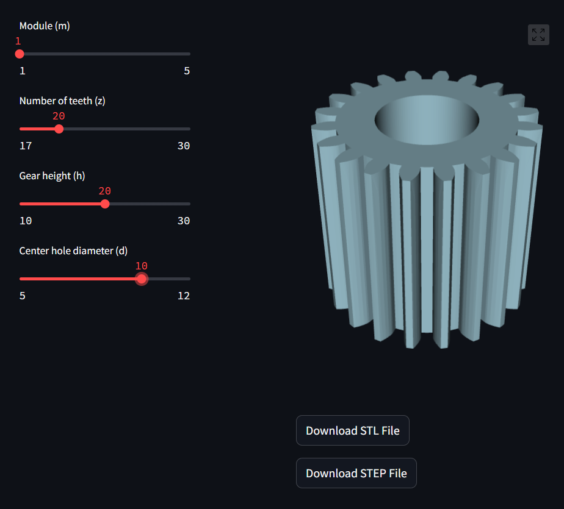

How to launch the project:
---
1. Clone the repository.
2. Install the required packages using the command `pip install -r requirements.txt`.
3. Run the command e.g. `python -m streamlit run gear_model.py` to launch the Streamlit `gear_model.py` app.
4. The app will open in your default browser:

### Alternatively you can launch the project in docker container:
Run the command: `docker-compose up -d`